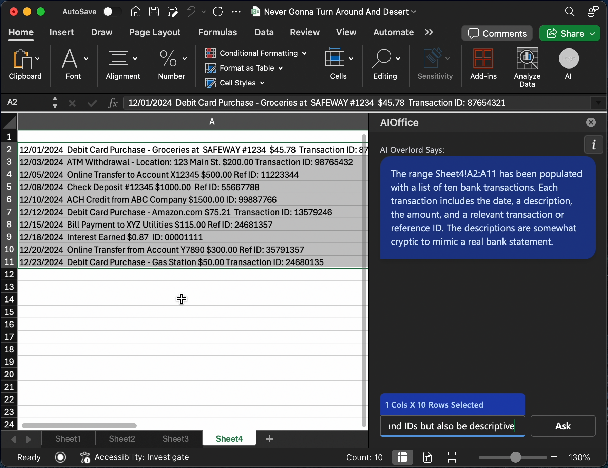
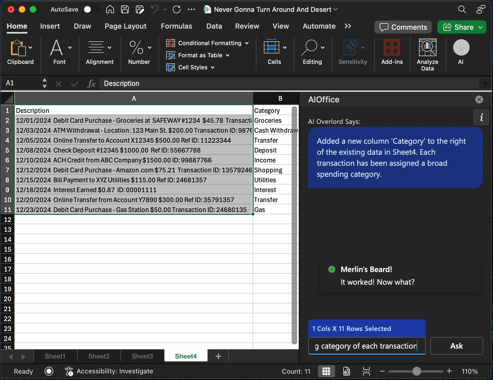
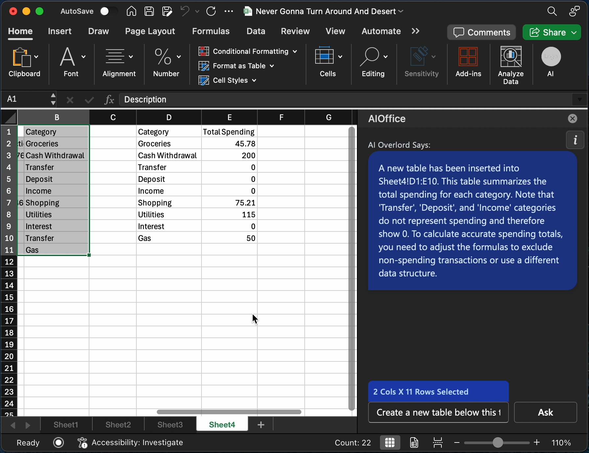

> _"If it looks AI generated, it probably is"_  
> -Buddha

# MS Office AI – Bring Gemini (and friends) to Excel (and more)

A lightweight Office Add-in that integrates Google Gemini directly into Excel.  
This repo can easily be extended to add support for OpenAI's ChatGPT and other LLMs, as well as Word, Powerpoint and other Office apps.

## Example Usage and Screenshots
<div style="max-width: 48rem;">

<span><strong>1. Generating a list of bank transactions to demo the AI in action</strong></span>


<span><strong>2. Prompting the AI to categorize the transactions</strong></span>


<span><strong>3. Summarizing the categories</strong></p>


</div>

## 🚀 Features

- 🔌 **Out-of-the-box support for Google Gemini**. Feel free to open a PR to add ChatGPT or other LLMs.
- 📈 **Natural language interaction** with spreadsheet content.
- 🧠 **Context-aware chat** that understands and manipulates Excel data.
- 🧩 **Modular architecture** – extend functionality to **Word**, **PowerPoint**, and more.
- ⚙️ Built with **React**, **TypeScript**, and **Office.js** for a modern development experience.

## 🛠️ Installation

Follow these steps to get started:

```bash
git clone https://github.com/menahishayan/MS-Office-AI
cd MS-Office-AI
```
Add your API key in a `.env` file at the root level
```bash
npm install
npm run start
```

> **Note:** Ensure you have [Office Add-in development tools](https://learn.microsoft.com/office/dev/add-ins/overview/office-add-ins) installed and sideloading enabled in Excel.

## 📦 Prerequisites

Before you begin, make sure you have:

- **Node.js** installed on your system.
- **Excel** (desktop or web) with Office Add-ins enabled.
- An **API key** from Google Gemini.

## 💬 How It Works

1. **Select data or context** from your Excel sheet.
2. **Interact with the AI panel** by asking questions or requesting transformations.
3. The AI can **insert, replace, or update content** directly in your spreadsheet.

## 🗂️ Project Structure

The `src/taskpane` folder contains the main source code for the task pane:

- **components/**: React components used in the task pane UI.
  - **App.tsx**: Where the magic happens
- **index.tsx**: Entry point for rendering the React application.
- **taskpane.ts**: Contains Excel-related logic and event handlers.

## 📝 TODO

- [ ] Add support for multiple LLMs (e.g., OpenAI's ChatGPT).
- [ ] Extend functionality to **Word** and **PowerPoint**.
- [ ] Display chat history in the UI
- [ ] ! Undo button
- [ ] `ContextWindowMemory`
- [ ] Make prompt input multi-line

## 🤝 Contributing

We welcome contributions! Here's how you can help:

- Add support for a new **LLM** or **Office app**.
- Suggest or implement new features.
- Report bugs or open issues.

To contribute:

1. Fork the repository.
2. Create a new branch for your feature or fix.
3. Submit a pull request with a detailed description.
